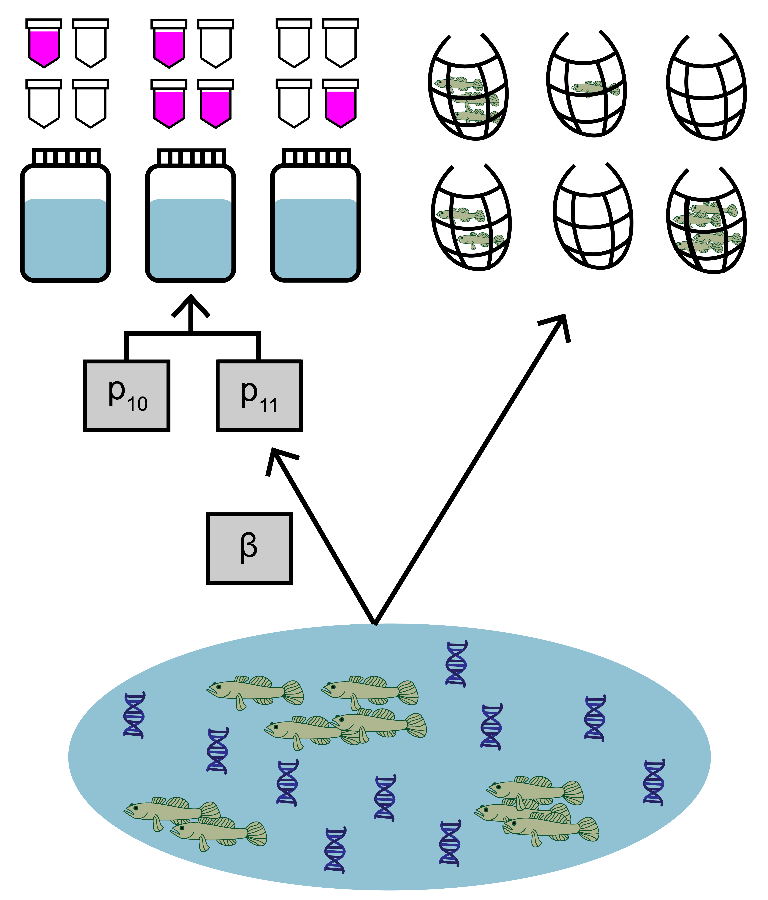

# Use case 1: basic use of `jointModel()` {#usecase1}

This first use case will show how to fit and interpret the joint model with paired eDNA and traditional survey data.

<br>

```{r, echo=FALSE, out.width='50%', fig.align='center'}

```

<br>


The data used in this example comes from a study by Schmelzle and Kinziger (2016) about endangered tidewater gobies (*Eucyclogobius newberryi*) in California. Environmental DNA samples were collected at 39 sites, along with paired traditional seine sampling. The eDNA data is detection/non-detection data generated through quantitative polymerase chain reaction (qPCR).

## Prepare the data

Both eDNA and traditional survey data should have a hierarchical structure:

* Sites (primary sample units) within a study area
* eDNA and traditional samples (secondary sample units) collected from each site
* eDNA subsamples (replicate observations) taken from each eDNA sample

Ensuring that your data is formatted correctly is essential for successfully using *eDNAjoint*. Let's first explore the structure of the goby data.

```{r}
library(eDNAjoint)
data(gobyData)
str(gobyData)
```

You can see that the data is a list of four matrices all with the same number of rows that represent each site (n=39). Across all matrices, rows in the data should correspond to the same sites (i.e., row one in all matrices corresponds to site one, and row 31 in all matrices corresponds to site 31).

`qPCR.K`, `qPCR.N`, and `count` are required for all implementations of `jointModel()`, and `site.cov` is optional and will be used in [use case 2](#usecase2). 

Let's look first at `qPCR.K`. These are the total number of positive qPCR detections for each site (row) and eDNA sample (column). The number of columns should equal the maximum number of eDNA samples collected at any site. Blank spaces are filled with NA at sites where fewer eDNA samples were collected than the maximum.

For example, at site one, 11 eDNA samples were collected, and at site five, 20 eDNA samples were collected.

```{r}
head(gobyData$qPCR.K)
```

Now let's look at `qPCR.N`. These are the total number of qPCR eDNA subsamples (replicate observations) collected for each site (row) and eDNA sample (column). In this data, six qPCR replicate observations were collected for each eDNA sample. Notice that the locations of the NAs in the matrix match `qPCR.K`.

```{r}
head(gobyData$qPCR.N)
```

Next, let's look at `count`. This data is from seine sampling for tidewater gobies. Each integer refers to the catch of each seine sample (i.e., catch per unit effort, when effort = 1). Again, the rows correspond to sites, and the columns refer to replicated seine samples (secondary sample units) at each site, with a maximum of 22 samples. Blank spaces are filled with NA at sites where fewer seine samples were collected than the maximum.

In this example, the count data are integers, but continuous values can be used in the model (see Eq. 1.3 in the [model description](#modeldescription)).

```{r}
head(gobyData$count)
```


### Converting data from long to wide {#longtowide}

Using `eDNAjoint` requires your data to be in "wide" format. Wide vs. long data refers to the shape of your data in tidyverse jargon (see more [here](https://tavareshugo.github.io/r-intro-tidyverse-gapminder/09-reshaping/index.html)). Below is an example for how to convert your data to wide format.

First let's simulate "long" qPCR data.

```{r}
## data dimensions
# number of sites (primary sample units)
nsite <- 4 
# number of eDNA samples (secondary sample units)
neDNA_samples <- 6 
# number of traditional samples (secondary sample units)
ntraditional_subsamples <- 8 
# number of eDNA subsamples (replicate observations)
neDNA_subsamples <- 3

# simulate qPCR data
qPCR_long <- data.frame(
  site = rep(1:nsite, each = neDNA_samples),
  eDNA_sample = rep(1:neDNA_samples, times = nsite),
  N = rep(neDNA_subsamples, nsite*neDNA_samples),
  K = c(
    rbinom(neDNA_samples, neDNA_subsamples, 0.1), # site 1 positive detections
    rbinom(neDNA_samples, neDNA_subsamples, 0.6), # site 2 positive detections
    rbinom(neDNA_samples, neDNA_subsamples, 0), # site 3 positive detections
    rbinom(neDNA_samples, neDNA_subsamples, 0.4) # site 4 positive detections
  )
)

head(qPCR_long)
```
And simulate "long" traditional data:

```{r}
# simulate traditional count data
count_long <- data.frame(
  site = rep(1:nsite, each = ntraditional_subsamples),
  traditional_sample = rep(1:ntraditional_subsamples, times = nsite),
  count = c(
    rpois(ntraditional_subsamples, 0.5), # site 1 count data
    rpois(ntraditional_subsamples, 4), # site 2 count data
    rpois(ntraditional_subsamples, 0), # site 3 count data
    rpois(ntraditional_subsamples, 2) # site 4 count data
  )
)

head(count_long)
```

Now let's convert the data from "long" to "wide".

```{r, results = 'hide', message=FALSE, warning=FALSE}
library(tidyverse)
```

```{r}
# N: number of qPCR eDNA subsamples (i.e., replicate observations) 
# per eDNA sample (i.e., secondary sample)
qPCR_N_wide <- qPCR_long %>% 
  pivot_wider(id_cols=site,
              names_from=eDNA_sample,
              values_from=N) %>% 
  arrange(site) %>% 
  select(-site)

# K: number of positive qPCR detections in each 
# eDNA sample (i.e., secondary sample)
qPCR_K_wide <- qPCR_long %>% 
  pivot_wider(id_cols=site,
              names_from=eDNA_sample,
              values_from=K) %>% 
  arrange(site) %>% 
  select(-site)

# count: number of individuals in each traditional sample 
# (i.e., secondary sample)
count_wide <- count_long %>% 
  pivot_wider(id_cols=site,
              names_from=traditional_sample,
              values_from=count) %>% 
  arrange(site) %>% 
  select(-site)
```

Finally, we'll bundle this data up into a named list of matrices.

```{r}
data <- list(
  qPCR.N = as.matrix(qPCR_N_wide),
  qPCR.K = as.matrix(qPCR_K_wide),
  count = as.matrix(count_wide)
)
```


## Fit the model

Now that we understand our data, let's fit the joint model. The key arguments of this function include:

1. data: list of `qPCR.K`, `qPCR.N`, and `count` matrices
2. family: probability distribution used to model the seine count data. A poisson distribution is chosen here.
3. p10priors: Beta distribution parameters for the prior on the probability of false positive eDNA detection, $p_{10}$. c(1,20) is the default specification. More on this later.
4. q: logical value indicating the presence of multiple traditional gear types. Here, we're only using data from one traditional method.

More parameters exist to further customize the MCMC sampling, but we'll stick with the defaults.

```{r, message = FALSE, warning = FALSE, results = 'hide'}
# run the joint model 
goby.fit1 <- jointModel(data = gobyData, family = 'poisson', 
                        p10priors = c(1,20), q=FALSE)
```

`goby.fit1` is a list containing:

1. model fit (`goby.fit1$model`) of the class 'stanfit' and can be accessed and interpreted using all functions in the [rstan](https://mc-stan.org/rstan/) package.
2. initial values used for each chain in MCMC (`goby.fit1$inits`)

## Model selection

We previously made a choice to use a poisson distribution to describe the count data. This distribution assumes that the mean equals variance for count data at each site. Perhaps we want to test how that model specification compares to a model specification using a negative binomial distribution, which allows the variance of the count data to be greater than the mean.

```{r, message = FALSE, warning = FALSE, results = 'hide'}
# fit a new model with negative binomial distribution
goby.fit2 <- jointModel(data = gobyData, family = 'negbin', 
                        p10priors = c(1,20), q=FALSE)
```

We can now compare the fit of these model to our data using the `jointSelect()` function, which performs leave-one-out cross validation with functions from the `loo` package.

```{r, warning = FALSE}
# perform model selection
jointSelect(modelfits = list(goby.fit1$model, goby.fit2$model))
```

These results tell us that model1 has a higher Bayesian LOO estimate of the expected log pointwise predictive density ([elpd_loo](https://mc-stan.org/loo/reference/loo-glossary.html)). This means that `goby.fit1` is likely a better fit to the data.

## Interpret the output

### Summarize posterior distributions

Let's interpret `goby.fit1`. Use `jointSummarize()` to see the posterior summaries of the model parameters.

```{r}
jointSummarize(goby.fit1$model, par = c('p10','beta'))
```
This summarizes the mean, sd, and quantiles of the posterior estimates of $p_{10}$ and $\beta$, as well as the effective sample size (n_eff) and Rhat for the parameters.

The mean estimated probability of a false positive eDNA detection is 0.001. $\beta$ is the parameter that scales the sensitivity between eDNA and traditional sampling.

We can also use functions from the `bayesplot` package to examine the posterior distributions and chain convergence.

First let's look at the posterior distribution for $p_{10}$.

```{r, message = FALSE, warning = FALSE}
library(bayesplot)
# plot posterior distribution, highlighting median and 80% credibility interval
mcmc_areas(as.matrix(goby.fit1$model), pars = 'p10', prob = 0.8)
```

Next let's look at chain convergence for $p_{10}$ and $\mu_{i=1}$.

```{r, message = FALSE, warning = FALSE}
# this will plot the MCMC chains for p10 and mu at site 1
mcmc_trace(rstan::extract(goby.fit1$model, permuted = FALSE), 
           pars = c('p10', 'mu[1]'))

```

### Effort necessary to detect presence

To further highlight the relative sensitivity of eDNA and traditional sampling, we can use `detectionCalculate()` to find the units of survey effort necessary to detect presence of the species. Here, detecting presence refers to producing at least one true positive eDNA detection or catching at least one individual in a traditional survey.

This function is finding the median number of survey units necessary to detect species presence if the expected catch rate, $\mu$ is 0.1, 0.5, or 1. 

```{r}
detectionCalculate(goby.fit1$model, mu=c(0.1,0.5,1), probability = 0.9)
```

We can also plot these comparisons. `mu.min` and `mu.max` define the x-axis in the plot.

```{r, fig.width = 7}
detectionPlot(goby.fit1$model, mu.min=0.1, mu.max =1, probability = 0.9)
```

### Calculate $\mu_{critical}$

The probability of a true positive eDNA detection, $p_{11}$, is a function of the expected catch rate, $\mu$. Low values of $\mu$ correspond to low probability of eDNA detection. Since the probability of a false-positive eDNA detection is non-zero, the probability of a false positive detection may be higher than the probability of a true positive detection at very low values of $\mu$.

$\mu_{critical}$ describes the value of $\mu$ where the probability of a false positive eDNA detection equals the probability of a true positive eDNA detection. This value can be calculated using `muCritical()`. 

```{r}
muCritical(goby.fit1$model, ci = 0.9)
```

This function calculates $\mu_{critical}$ using the entire posterior distributions of parameters from the model, and 'HDI' corresponds to the 90% credibility interval calculated using the highest density interval.

## Prior sensitivity analysis

The previous model implementation used default values for the beta prior distribution for $p_{10}$. The choice of these prior parameters can impose undue influence on the model's inference. The best way to investigate this is to perform a prior sensitivity analysis. 

Let's look at how three prior choices affect the posterior estimates of $p_{10}$ and $\beta$. 

Prior choice 1: default prior parameters c(1,20). The mean and sd of this prior distribution are 0.048 and 0.045, respectively.

```{r}
fit.prior.1 <- goby.fit1$model
jointSummarize(fit.prior.1, par = c('p10','beta'))
```

Prior choice 2: c(1,15). The mean and sd of this prior distribution are 0.063 and 0.058, respectively.
```{r, message = FALSE, warning = FALSE, results = 'hide'}
fit.prior.2 <- jointModel(data = gobyData, family = 'poisson', 
                          p10priors = c(1,15), q=FALSE)
```

```{r}
jointSummarize(fit.prior.2$model, par = c('p10','beta'))
```

Prior choice 3: c(1,10). The mean and sd of this prior distribution are 0.091 and 0.083, respectively.
```{r, message = FALSE, warning = FALSE, results = 'hide'}
fit.prior.3 <- jointModel(data = gobyData, family = 'poisson', 
                          p10priors = c(1,10), q=FALSE)
```

```{r}
jointSummarize(fit.prior.3$model, par = c('p10','beta'))
```

You can see that the choice of the $p_{10}$ prior within this range has little influence on the estimated parameters.

## Initial values {#initialvalues1}

By default, `eDNAjoint` will provide initial values for parameters estimated by the model, but you can provide your own initial values if you prefer. Here is an example of providing initial values for parameters, `mu`,`p10`, and `beta`, as an input in `jointModel()`.

```{r}
# set number of chains
n.chain <- 4

# initial values should be a list of named lists
inits <- list()
for(i in 1:n.chain){
  inits[[i]] <- list(
    # length should equal the number of sites (dim(gobyData$count)[1]) for each chain
    mu = stats::runif(dim(gobyData$count)[1], 0.01, 5), 
    # length should equal 1 for each chain 
    p10 = stats::runif(1,0.0001,0.08),
    # length should equal 1 for each chain 
    beta = stats::runif(1,0.05,0.2)
    )
}

# now fit the model
fit.w.inits <- jointModel(data = gobyData, initial_values = inits)

# check to see the initial values that were used
fit.w.inits$inits

```


