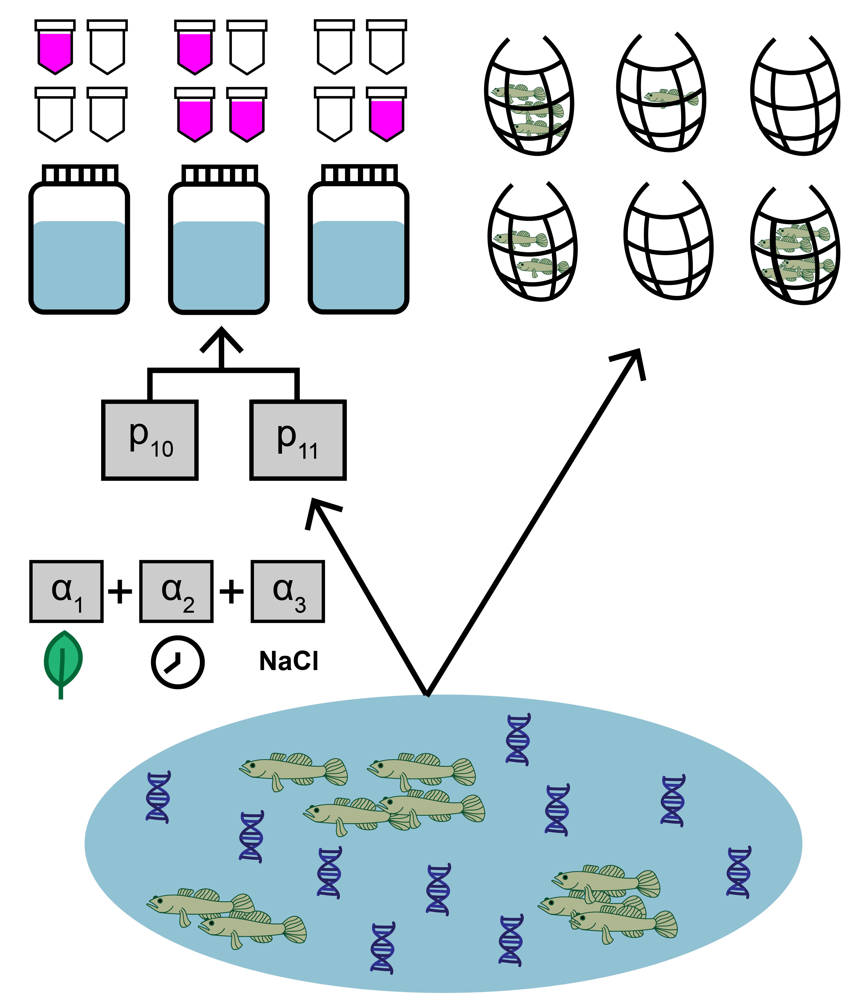

---
output:
  pdf_document: default
  html_document: default
---
# Use case 2: `jointModel()` with site-level covariates {#usecase2}

This second use case uses the same goby data as in [use case 1](#usecase1), except this time we will include site-level covariates that affect the sensitivity of eDNA relative to traditional surveys.

<br>

```{r, echo=FALSE, out.width='50%', fig.align='center'}

```

<br>


```{r}
library(eDNAjoint)
data(gobyData)
```


In addition to count and qPCR data, the goby data includes site-level covariates, which is optional when implementing `jointModel()`. Here, the data represent salinity, mean time to filter eDNA samples, density of other fish, habitat size, and vegetation presence at each site. Two important notes:

1. Notice that the continuous covariate data is standardized. This is useful since this data will be used in a linear regression. Similarly, one should use dummy variables for categorical variables (like the 'Veg' variable).

2. The columns in the matrix should be named, since these identifiers will be used when fitting the model.

```{r}
head(gobyData$site.cov)
```

For more data formatting guidance, see [section 2.1.1](#longtowide).

## Fit the model

Now that we understand our data, let's fit the joint model. The key arguments of this function include:

1. data: list of `qPCR.K`, `qPCR.N`, `count`, and `site.cov` matrices
2. cov: character vector of site-level covariates (this model will only include mean eDNA sample filter time and salinity)
3. family: probability distribution used to model the seine count data. A poisson distribution is chosen here.
4. p10priors: Beta distribution parameters for the prior on the probability of false positive eDNA detection, $p_{10}$. c(1,20) is the default specification. More on this later.
5. q: logical value indicating the presence of multiple traditional gear types. Here, we're only using data from one traditional method.

More parameters exist to further customize the MCMC sampling, but we'll stick with the defaults.

```{r, message = FALSE, warning = FALSE, results = 'hide'}
# run the joint model with two covariates
goby.fit.cov1 <- jointModel(data = gobyData, cov=c('Filter_time','Salinity'), 
                            family = 'poisson', p10priors = c(1,20), q=FALSE)
```

`goby.fit.cov1` is a list containing:

1. model fit (`goby.fit.cov1$model`) of the class 'stanfit' and can be accessed and interpreted using all functions in the [rstan](https://mc-stan.org/rstan/) package.
2. initial values used for each chain in MCMC (`goby.fit.cov1$inits`)

## Model selection

We previously made a choice to include two site-level covariates. Perhaps we want to test how that model specification compares to a model specification with different site-level covariates.

```{r, message = FALSE, warning = FALSE, results = 'hide'}
# fit a new model with one site-level covariate
goby.fit.cov2 <- jointModel(data = gobyData, cov='Other_fishes',
                            family = 'poisson', p10priors = c(1,20), q=FALSE)
```

We can now compare the fit of these model to our data using the `jointSelect()` function, which performs leave-one-out cross validation with functions from the `loo` package.

```{r, warning = FALSE}
# perform model selection
jointSelect(modelfits = list(goby.fit.cov1$model, goby.fit.cov2$model))
```

These results tell us that model1 has a higher Bayesian LOO estimate of the expected log pointwise predictive density ([elpd_loo](https://mc-stan.org/loo/reference/loo-glossary.html)). This means that `goby.fit.cov1` is likely a better fit to the data.

You could keep going with this further and include/exclude different covariates, or compare to a null model without covariates.

## Interpret the output

### Summarize posterior distributions

Let's interpret `goby.fit.cov1`. Use `jointSummarize()` to see the posterior summaries of the model parameters.

```{r}
jointSummarize(goby.fit.cov1$model, par = c('p10','alpha'))
```
This summarizes the mean, sd, and quantiles of the posterior estimates of $p_{10}$ and $\alpha$, as well as the effective sample size (n_eff) and Rhat for the parameters.

The mean estimated probability of a false positive eDNA detection is 0.001. In [use case 1](#usecase1), the scalar parameter $\beta$ was used to scale the relationship between eDNA and traditional sampling, but now the vector $\alpha$ represents the regression covariates that scales this relationship (see [model description](#modeldescription) for more). `alpha[1]` corresponds to the intercept of the regression with site-level covariates. `alpha[2]` corresponds to the regression coefficient associated with `Filter_time`, and `alpha[3]` corresponds to the regression coefficient associated with `Salinity`. Positive regression coefficients indicate an inverse relationship between the covariate and eDNA sensitivity.

We can also use functions from the `bayesplot` package to examine the posterior distributions and chain convergence.

First let's look at the posterior distribution for $p_{10}$.

```{r, message = FALSE, warning = FALSE}
library(bayesplot)
# plot posterior distribution, highlighting median and 80% credibility interval
mcmc_areas(as.matrix(goby.fit.cov1$model), pars = 'p10', prob = 0.8)
```

Next let's look at chain convergence for $p_{10}$ and $\mu_{i=1}$.

```{r, message = FALSE, warning = FALSE}
# this will plot the MCMC chains for p10 and mu at site 1
mcmc_trace(rstan::extract(goby.fit.cov1$model, permuted = FALSE), 
           pars = c('p10', 'mu[1]'))

```

### Effort necessary to detect presence

To further highlight the relative sensitivity of eDNA and traditional sampling, we can use `detectionCalculate()` to find the units of survey effort necessary to detect presence of the species. Here, detecting presence refers to producing at least one true positive eDNA detection or catching at least one individual in a traditional survey.

This function is finding the median number of survey units necessary to detect species presence if the expected catch rate, $\mu$ is 0.1, 0.5, or 1. The `cov.val` argument indicates the value of the covariates used for the prediction. Since the covariate data was standardized, c(0,0) indicates that the prediction is made at the mean `Filter_time` and `Salinity` values.

```{r}
detectionCalculate(goby.fit.cov1$model, mu=c(0.1,0.5,1), 
                   cov.val = c(0,0), probability = 0.9)
```

We can see that at the mean covariate values, it takes 14 eDNA samples or 24 seine samples to detect goby presence with 0.9 probability if the expected catch rate is 0.1. 

Now let's perform the same calculation under a condition where the `Filter_time` covariate value is 0.5 z-scores above the mean.

```{r}
detectionCalculate(goby.fit.cov1$model, mu=c(0.1,0.5,1), 
                   cov.val = c(0.5,0), probability = 0.9)
```

At sites with a longer eDNA sample filter time, it would now take 22 eDNA samples or 24 seine samples to detect goby presence if the expected catch rate is 0.1.

Let's do the same for salinity.

```{r}
detectionCalculate(goby.fit.cov1$model, mu=c(0.1,0.5,1), 
                   cov.val = c(0,0.5), probability = 0.9)
```
At sites with higher salinity, it would now take 12 eDNA samples or 24 seine samples to detect goby presence if the expected catch rate is 0.1.

We can also plot these comparisons. `mu.min` and `mu.max` define the x-axis in the plot.

```{r, fig.width = 7}
detectionPlot(goby.fit.cov1$model, mu.min=0.1, mu.max =1, 
              cov.val = c(0,0), probability = 0.9)
```

### Calculate $\mu_{critical}$

The probability of a true positive eDNA detection, $p_{11}$, is a function of the expected catch rate, $\mu$. Low values of $\mu$ correspond to low probability of eDNA detection. Since the probability of a false-positive eDNA detection is non-zero, the probability of a false positive detection may be higher than the probability of a true positive detection at very low values of $\mu$.

$\mu_{critical}$ describes the value of $\mu$ where the probability of a false positive eDNA detection equals the probability of a true positive eDNA detection. This value can be calculated using `muCritical()`. Here, we will calculate this value at the mean covariate values.

```{r}
muCritical(goby.fit.cov1$model, cov.val = c(0,0), ci = 0.9)
```

This function calculates $\mu_{critical}$ using the entire posterior distributions of parameters from the model, and 'HDI' corresponds to the 90% credibility interval calculated using the highest density interval.

## Initial values {#initialvalues2}

By default, `eDNAjoint` will provide initial values for parameters estimated by the model, but you can provide your own initial values if you prefer. Here is an example of providing initial values for parameters, `mu`,`p10`, and `alpha`, as an input in `jointModel()`.

```{r}
# set number of chains
n.chain <- 4

# initial values should be a list of named lists
inits <- list()
for(i in 1:n.chain){
  inits[[i]] <- list(
    # length should equal the number of sites (dim(gobyData$count)[1]) for each chain
    mu = stats::runif(dim(gobyData$count)[1], 0.01, 5), 
    # length should equal 1 for each chain 
    p10 = stats::runif(1,0.0001,0.08),
    # length should equal the number of covariates plus 1 (to account for intercept in regression)
    alpha = rep(0.1,length(c('Filter_time','Salinity'))+1)
    )
}

# now fit the model
fit.w.inits <- jointModel(data = gobyData, cov=c('Filter_time','Salinity'),
                          initial_values = inits)

# check to see the initial values that were used
fit.w.inits$inits

```