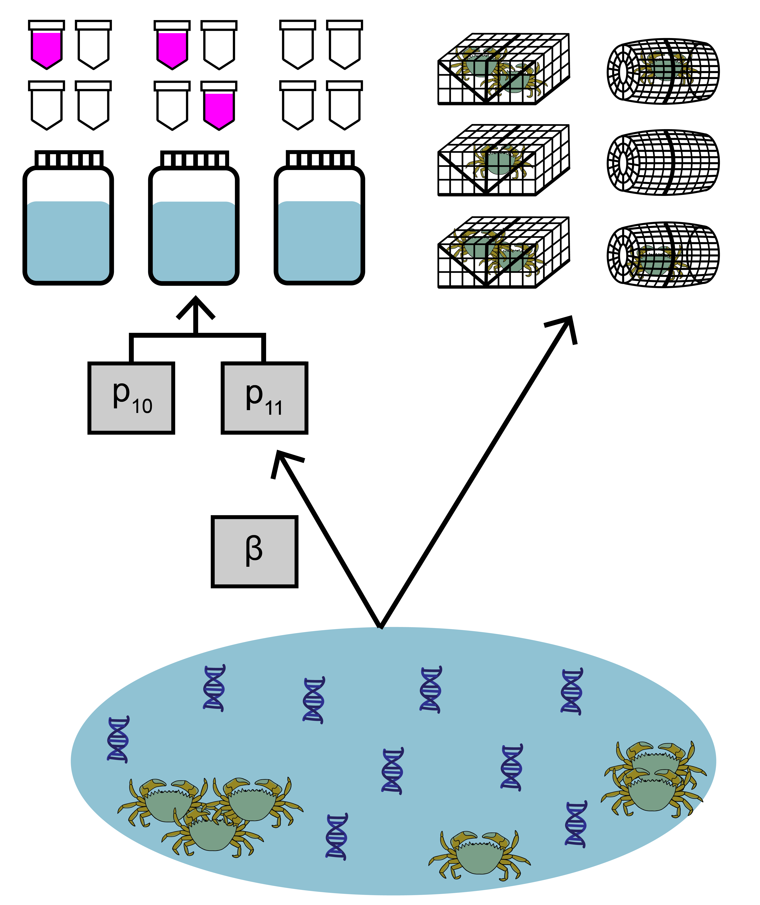

---
output:
  pdf_document: default
  html_document: default
---
# Use case 3: `jointModel()` with multiple traditional gear types {#usecase3}

This third use case will show how to fit and interpret the joint model with paired eDNA and traditional survey data when multiple traditional gear types have been used. These different gear types may have different expected catch rates, $\mu$, represented by gear-specific scaling coefficients *q*.

<br>

```{r, echo=FALSE, out.width='50%', fig.align='center'}

```

<br>


The data used in this example comes from a study by Keller et al. (2022) about invasive European green crab (*Carcinus maenas*) in Washington state. Environmental DNA samples were collected at 20 sites, along with paired baited trap sampling. The eDNA data is detection/non-detection data generated through quantitative polymerase chain reaction (qPCR).

## Prepare the data

Similar to the goby data, the green crab data is still a list of matrices. Now, instead of data on site-level covariates, `site.cov`, there is data representing the gear type for each of the traditional samples, `count.type`.

```{r}
library(eDNAjoint)
data(greencrabData)
names(greencrabData)
```

Again, all matrices should have the same number of rows (n=20), and rows across all four matrices should correspond to the same sites.

Let's look at the `count`. This data is from baited trap sampling for green crab. Each integer refers to the catch of each trap (i.e., catch per unit effort, when effort = 1). The rows correspond to sites, and the columns refer to the replicated trap samples (secondary sample units) at each site, with a maximum of 420 samples. 

```{r}
dim(greencrabData$count)
```

Blank spaces are filled with NA at sites where fewer trap samples were collected than the maximum. In this example, the count data are integers, but continuous values can be used in the model (see Eq. 1.3 in the model description).

```{r}
greencrabData$count[1:6,1:20]
```

Next, let's look at `count.type`, which consists of integer indicators of gear type for each trap sample. Here, 1 refers to the Fukui gear type, and 2 refers to the Minnow gear type.

```{r}
greencrabData$count.type[1:6,1:20]
```

Note that the locations of the NAs in this matrix match `count`.

For more data formatting guidance, see [section 2.1.1](#longtowide).


## Fit the model

Now that we understand our data, let's fit the joint model. The key arguments of this function include:

1. data: list of `qPCR.K`, `qPCR.N`, `count`, and `count.type` matrices
2. cov: no site-level covariates are included in this model
3. family: probability distribution used to model the trap count data. A negative binomial distribution is chosen here.
4. p10priors: Beta distribution parameters for the prior on the probability of false positive eDNA detection, $p_{10}$. c(1,20) is the default specification. 
5. q: logical value indicating the presence of multiple traditional gear types.

More parameters exist to further customize the MCMC sampling, but we'll stick with the defaults.

```{r, message = FALSE, warning = FALSE, results = 'hide'}
# run the joint model with gear scaling coefficients
greencrab.fit.q.negbin <- jointModel(data = greencrabData, cov = NULL, family = 'negbin', 
                                     p10priors = c(1,20), q = TRUE)
```

## Model selection

We previously made a choice to model the green crab count data with a negative binomial distribution. Perhaps we want to test how that model specification compares to a model specification where count data is modeled with a poisson distribution.

```{r, message = FALSE, warning = FALSE, results = 'hide'}
# run the joint model with poisson distribution
greencrab.fit.q.pois <- jointModel(data = greencrabData, cov=NULL, family = 'poisson', 
                                   p10priors = c(1,20), q=TRUE)
```

Let's also fit some models where we assume that both gear types have the same catchability. We set q=FALSE to not estimate gear scaling coefficients.
```{r, message = FALSE, warning = FALSE, results = 'hide'}
# run the joint model with four covariates
greencrab.fit.negbin <- jointModel(data = greencrabData, cov=NULL, family = 'negbin', 
                                   p10priors = c(1,20), q=FALSE)
greencrab.fit.pois <- jointModel(data = greencrabData, cov=NULL, family = 'poisson', 
                                 p10priors = c(1,20), q=FALSE)
```

Now let's perform model selection using leave-one-out cross validation.

```{r, warning = FALSE}
# perform model selection
jointSelect(modelfits = list(
  # include gear scaling coefficient, model count data with negative binomial
  greencrab.fit.q.negbin$model, 
  # include gear scaling coefficient, model count data with poisson
  greencrab.fit.q.pois$model, 
  # include gear scaling coefficient, model count data with negative binomial
  greencrab.fit.negbin$model, 
  # include gear scaling coefficient, model count data with poisson
  greencrab.fit.pois$model)) 
```


These results tell us that models one and three (models with and without gear scaling coefficients for the gear types) that use a negative binomial distribution for count data have similar Bayesian LOO estimates of the expected log pointwise predictive density (elpd_loo). Notably, a negative binomial distribution represents the data-generating process for our count data much better than a poisson distribution.

## Interpret the output

### Summarize posterior distributions

For the sake of illustration, let's interpret the results of the model fit with gear scaling coefficients. Use `jointSummarize()` to see the posterior summaries of the model parameters.

```{r}
jointSummarize(greencrab.fit.q.negbin$model, par = c('p10','beta','q'))
```

This summarizes the mean, sd, and quantiles of the posterior estimates of $p_{10}$, $\beta$, and *q*, as well as the effective sample size (n_eff) and Rhat for the parameters.

The mean estimated probability of a false positive eDNA detection is ~0.01. `beta` is the parameter that scales the sensitivity of eDNA sampling relative to trap sampling. `q[1]` represents the gear scaling coefficient of gear type 2, which scales the catch rate of gear type 2 relative to gear type 1. 

Now let's look at the summary of `mu`.

```{r}
jointSummarize(greencrab.fit.q.negbin$model, par = 'mu')
```

`mu[1,1]` corresponds to the expected catch rate at site 1 with gear type 1. `mu[1,2]` corresponds to the expected catch rate at site 1 with gear type 2. `mu[2,1]` corresponds to the expected catch rate at site 2 with gear type 1.

We can also use functions from the `bayesplot` package to examine the posterior distributions and chain convergence.

First let's look at the posterior distribution for $p_{10}$.

```{r}
library(bayesplot)

# plot posterior distribution, highlighting median and 80% credibility interval
mcmc_areas(as.matrix(greencrab.fit.q.negbin$model), pars = 'p10', prob = 0.8)
```

Next let's look at chain convergence for $p_{10}$ and $\beta$.

```{r}
# this will plot the MCMC chains for p10 and mu at site 1
mcmc_trace(rstan::extract(greencrab.fit.q.negbin$model, permuted = FALSE), 
           pars = c('p10', 'beta'))

```

### Effort necessary to detect presence

To further highlight these results, we can use `detectionCalculate()` to find the units of survey effort necessary to detect presence of the species. This function is finding the median number of survey units necessary to detect species presence if the expected catch rate, $\mu$ is 0.1, 0.5, or 1.  $\mu$ now represents the expected catch rate of gear type 1.

```{r}
detectionCalculate(greencrab.fit.q.negbin$model, mu = c(0.1,0.5,1), 
                   probability = 0.9)
```

We can see that it takes 27 eDNA samples, 25 trap samples (gear type 1), and 31 trap samples (gear type 2) to detect green crab presence with 0.9 probability if the expected catch rate with gear type 1 is 0.1.

We can also plot these comparisons. `mu.min` and `mu.max` define the x-axis in the plot and represent the expected catch rate of gear type 1.

```{r, fig.width = 7}
detectionPlot(greencrab.fit.q.negbin$model, mu.min = 0.1, 
              mu.max = 1, probability = 0.9)
```

### Calculate $\mu_{critical}$

Now let's calculate $\mu_{critical}$, which is the value of $\mu$ where the probability of a false positive eDNA detection equals the probability of a true positive eDNA detection.

```{r}
muCritical(greencrab.fit.q.negbin$model, cov.val = NULL, ci = 0.9)
```

This function calculates $\mu_{critical}$ using the entire posterior distributions of parameters from the model, and 'HDI' corresponds to the 90% credibility interval calculated using the highest density interval. The first column corresponds to $\mu_{critical}$ if gear type 1 is used, and the second columns corresponds to $\mu_{critical}$ if gear type 2 is used.

## traditionalModel()

In some circumstances, it may be helpful to model just the traditional survey data without eDNA data for comparison. Use `traditionalModel` here, which requires the following parameters:

1. data: list of `count` and (optionally) `count.type` matrices
2. family: probability distribution used to model the trap count data. A negative binomial distribution is chosen here.
3. q: logical value indicating the presence of multiple traditional gear types.

More parameters exist to further customize the MCMC sampling, but we'll stick with the defaults.

```{r, eval = FALSE}
# run the traditional model model with gear scaling coefficients
greencrab.traditional <- traditionalModel(data = greencrabData, 
                                          family = 'negbin', q = TRUE) 
```
 
 
## Initial values {#initialvalues3}

By default, `eDNAjoint` will provide initial values for parameters estimated by the model, but you can provide your own initial values if you prefer. Here is an example of providing initial values for parameters, `mu`,`p10`, `beta`, and `q`, as an input in `jointModel()`.

```{r}
# set number of chains
n.chain <- 4

# initial values should be a list of named lists
inits <- list()
for(i in 1:n.chain){
  inits[[i]] <- list(
    # length should equal the number of sites (dim(greencrabData$count)[1]) for each chain
    mu = stats::runif(dim(greencrabData$count)[1], 0.01, 5), 
    # length should equal 1 for each chain 
    p10 = stats::runif(1,0.0001,0.08),
    # length should equal 1 for each chain 
    beta = stats::runif(1,0.05,0.2),
    # length should equal the number of gear types - 1
    q = stats::runif(
      sum(!is.na(unique(as.vector(greencrabData$count.type))))-1,
      0.5, 1.5
      )
    )
}

# now fit the model
fit.w.inits <- jointModel(data = greencrabData, 
                          q = TRUE, initial_values = inits)

# check to see the initial values that were used
fit.w.inits$inits

```