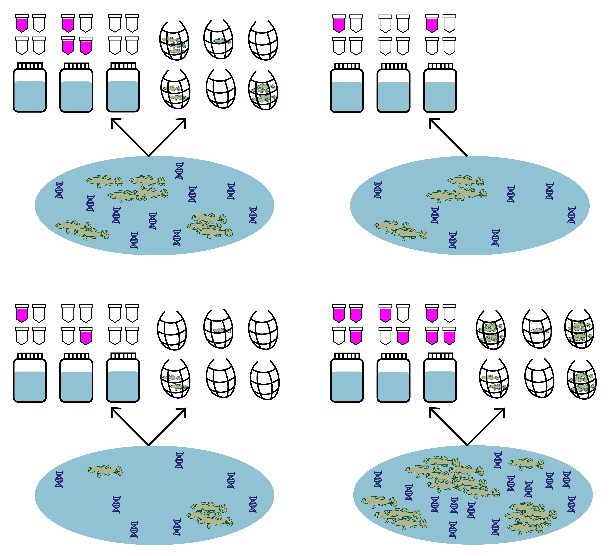

# Use case 4: `jointModel()` with semi-paired data {#usecase4}

This final use case shows how to fit and interpret the joint model with semi-paired eDNA and traditional survey data.

In many cases, you may have some sites where only eDNA samples were collected, while other sites have paired eDNA and traditional samples (i.e., semi-paired data). We can fit the joint model to this semi-paired data and use the sites with paired data to make predictions about the sites with only un-paired eDNA data.

<br>

```{r, echo=FALSE, out.width='50%', fig.align='center'}

```

<br>


Let's use the same tidewater goby data from uses cases [1](#usecase1) and [2](#usecase2), except let's pretend we did not have traditional seine sampling at two of the 39 sites.

## Simulate semi-paired data

Both eDNA and traditional survey data should have a hierarchical structure:

* Sites (primary sample units) within a study area
* eDNA and traditional samples (secondary sample units) collected from each site
* eDNA subsamples (replicate observations) taken from each eDNA sample

First replace the traditional count data at sites 4 and 34 with NA to simulate a scenario where we did not have traditional samples at these sites.

```{r}
library(eDNAjoint)
data(gobyData)

# create new dataset of semi-paired goby data
gobyData_semipaired <- gobyData
gobyData_semipaired$count[4,] <- NA
gobyData_semipaired$count[34,] <- NA
```

We can now see that we have no data at site 4:

```{r}
gobyData_semipaired$count[4,]
```
And site 34:

```{r}
gobyData_semipaired$count[34,]
```
It's important to ensure that we replace the data with NA so that we have an empty row indicating missing data. 

## Prepare the data


Now let's look at the format of the data. You can see that the data is a list of four matrices all with the same number of rows that represent each site (n=39). Across all matrices, rows in the data should correspond to the same sites (i.e., row one in all matrices corresponds to site one, and row 31 in all matrices corresponds to site 31).

`qPCR.K`, `qPCR.N`, and `count` are required for all implementations of `jointModel()`, and `site.cov` is optional and is used in [use case 2](#usecase2). 

Let's look first at `qPCR.K`. These are the total number of positive qPCR detections for each site (row) and eDNA sample (column). The number of columns should equal the maximum number of eDNA samples collected at any site. Blank spaces are filled with NA at sites where fewer eDNA samples were collected than the maximum.

For example, at site one, 11 eDNA samples were collected, and at site five, 20 eDNA samples were collected.

```{r}
head(gobyData_semipaired$qPCR.K)
```

Now let's look at `qPCR.N`. These are the total number of qPCR eDNA subsamples (replicate observations) collected for each site (row) and eDNA sample (column). In this data, six qPCR replicate observations were collected for each eDNA sample. Notice that the locations of the NAs in the matrix match `qPCR.K`.

```{r}
head(gobyData_semipaired$qPCR.N)
```

Next, let's look at `count`. This data is from seine sampling for tidewater gobies. Each integer refers to the catch of each seine sample (i.e., catch per unit effort, when effort = 1). Again, the rows correspond to sites, and the columns refer to replicated seine samples (secondary sample units) at each site, with a maximum of 22 samples. Blank spaces are filled with NA at sites where fewer seine samples were collected than the maximum, as well as at sites with no seine samples. Notice that the number of rows (i.e., number of sites) in the count data still equals the number of rows in the qPCR data, even though some of these sites have no count data.

```{r}
dim(gobyData_semipaired$count)[1] == dim(gobyData_semipaired$qPCR.K)[1]
```
For more data formatting guidance, see [section 2.1.1](#longtowide).

## Fit the model

Now that we understand our data, let's fit the joint model. The key arguments of this function include:

1. data: list of `qPCR.K`, `qPCR.N`, and `count` matrices
2. family: probability distribution used to model the seine count data. A poisson distribution is chosen here.
3. p10priors: Beta distribution parameters for the prior on the probability of false positive eDNA detection, $p_{10}$. c(1,20) is the default specification. More on this later.
4. q: logical value indicating the presence of multiple traditional gear types. Here, we're only using data from one traditional method.

More parameters exist to further customize the MCMC sampling, but we'll stick with the defaults.

```{r, message = FALSE, warning = FALSE, results = 'hide'}
# run the joint model 
goby.fit.semi <- jointModel(data = gobyData_semipaired, family = 'poisson', 
                            p10priors = c(1,20), q=FALSE)
```

`goby.fit.semi` is a list containing:

1. model fit (`goby.fit.semi$model`) of the class 'stanfit' and can be accessed and interpreted using all functions in the [rstan](https://mc-stan.org/rstan/) package.
2. initial values used for each chain in MCMC (`goby.fit.semi$inits`)

## Interpret the output

### Summarize posterior distributions

Let's interpret `goby.fit.semi`. Use `jointSummarize()` to see the posterior summaries of the model parameters. Let's look at the estimates of the expected catch rate at each site, $\mu$.

```{r}
jointSummarize(goby.fit.semi$model, par = 'mu')
```
This summarizes the mean, sd, and quantiles of the posterior estimates of $\mu$, as well as the effective sample size (n_eff) and Rhat for the parameters.

The model estimates $\beta$ using data from sites with paired samples and uses this estimate to make predictions for $\mu_{i=4}$ and $\mu_{i=34}$ where no traditional seine samples were collected.

We can also use functions from the `bayesplot` package to examine the posterior distributions.

First let's look at the posterior distributions for $\mu_{i=4}$ and $\mu_{i=29}$. Traditional seine samples were collected at site 29 but not at site 4.

```{r, message = FALSE, warning = FALSE}
library(bayesplot)
# plot posterior distribution, highlighting median and 80% credibility interval
mcmc_areas(as.matrix(goby.fit.semi$model), 
           pars = c('mu[4]', 'mu[29]'), prob = 0.8)
```

As you could expect, the credibility interval for the expected catch rate at site four is much wider than the credibility interval at site 29, since no traditional samples were collected at site four.

Let's do the same for $\mu_{i=7}$ and $\mu_{i=34}$. Traditional seine samples were collected at site 7 but not at site 34.

```{r, message = FALSE, warning = FALSE}
# plot posterior distribution, highlighting median and 80% credibility interval
mcmc_areas(as.matrix(goby.fit.semi$model), 
           pars = c('mu[7]', 'mu[34]'), prob = 0.8)
```

Again, the credibility interval for the expected catch rate at site 34 is wider with a longer tail than the credibility interval at site 7, since no traditional samples were collected at site 34.

**Note**: It's important to consider that fitting the joint model with semi-paired data will be more successful if there is paired data at most sites. Since the data at paired sites is leveraged to make predictions at the un-paired sites, you want to maximize the amount of data to leverage.

## Initial values {#initialvalues4}

By default, `eDNAjoint` will provide initial values for parameters estimated by the model, but you can provide your own initial values if you prefer. Here is an example of providing initial values for parameters, `mu`,`p10`, `beta`, and `q`, as an input in `jointModel()`.

```{r}
# set number of chains
n.chain <- 4

# initial values should be a list of named lists
inits <- list()
for(i in 1:n.chain){
  inits[[i]] <- list(
    # length should equal the number of sites (dim(gobyData_semipaired$count)[1]) for each chain
    mu = stats::runif(dim(gobyData_semipaired$count)[1], 0.01, 5), 
    # length should equal 1 for each chain 
    p10 = stats::runif(1,0.0001,0.08),
    # length should equal 1 for each chain 
    beta = stats::runif(1,0.05,0.2)
    )
}

# now fit the model
fit.w.inits <- jointModel(data = gobyData_semipaired, initial_values = inits)

# check to see the initial values that were used
fit.w.inits$inits

```