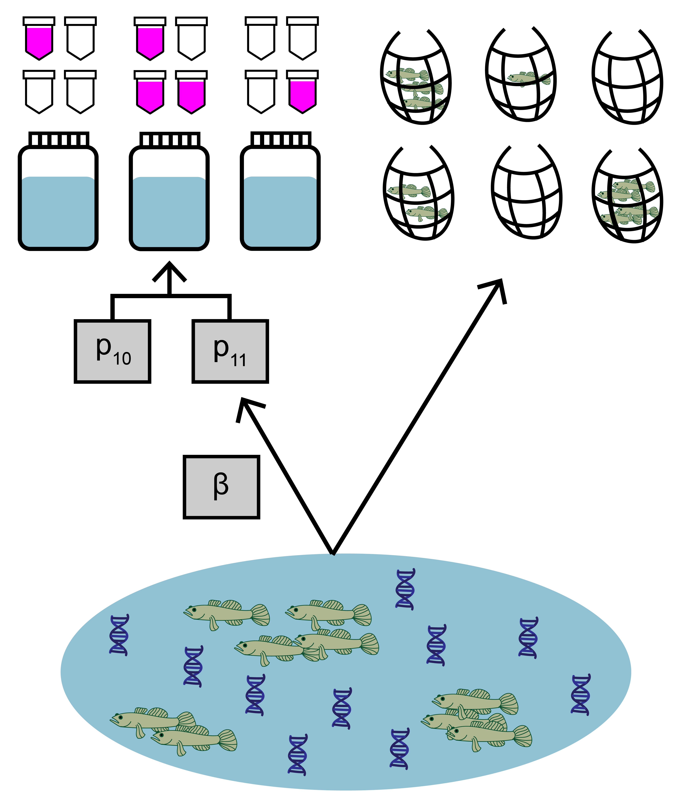

# Introduction {#intro}


This vignette provides examples and use cases of functions in the *eDNAjoint* package, as well as more details about the model that can be fit with *eDNAjoint*.

The primary purpose of the joint model is to use observations from both environmental DNA (eDNA) surveys and traditional surveys (i.e., seine sampling, trap sampling, etc.) to understand the relative sensitivities of the two survey types. The model uses both streams to data to jointly estimate parameters like expected catch rate, $\mu$, at a site and false positive probability of eDNA detection, $p_{10}$. The model is intended for use with with replicated, paired or semi-paired eDNA (binary, detection/non-detection) and traditional (count or continuous) observations at multiple sites across the landscape.

<br>

```{r, echo=FALSE, out.width='50%', fig.align='center'}

```

<br>

The main functionality in *eDNAjoint* is the use of `jointModel()` that will fit the model to data. Further functions like `jointSummarize()` and `detectionCalculate()` can be used to help with model fit interpretation.

This vignette contains detailed descriptions of four use cases of *eDNAjoint*:

1.  [Use case 1](#usecase1): basic use of `jointModel()` with paired eDNA and traditional samples
2.  [Use case 2](#usecase2): `jointModel()` with site-level covariates scale the sensitivity of eDNA sampling relative to traditional surveys
3.  [Use case 3](#usecase3): `jointModel()` here multiple traditional gear types are used
4.  [Use case 4](#usecase4): `jointModel()` with semi-paired eDNA and traditional samples (i.e., most sites have paired samples, yet some sites have only eDNA samples)

<br>

Below is a summary table of all parameters estimated by the model. More information about the model can be found in the [model description](#model).

```{r, echo=FALSE}
symbol <- c("$\\mu_{i,k}$","$p_{10}$","$q_k$","$\\beta$","$\\alpha_n$", "$\\phi$")
name <- c("mu", "p10", "q", "beta","alpha", "phi")
description <- c(paste0("Vector of expected catch rate at site, i. If multiple traditional gear types are used, mu is an array of expected catch rate at site, i, with gear type, k."),
          "Probability of false positive eDNA detection",
          paste0("Vector of gear scaling coefficients for traditional gear type, k."),
          paste0("Parameter that scales the sensitivity of eDNA relative to traditional sampling. If site-level covariates are used, ", 
                 "$\u03B2$", " is a vector of length, i, and a function of ", "$\u03B1_n$",". If site-level covariates are not used, ",
                 "$\u03B2$", " is a scalar."),
          paste0("Vector of regression coefficients for site-level covariates that scale the sensitivity of eDNA sampling relative to traditional sampling. Note ", "$\u03B1_1$", " refers to the regression intercept."),
          "Overdispersion parameter in negative binomial distribution, if used.")
param_table <- cbind(symbol,name,description)
knitr::kable(param_table,
             caption = "Parameters included in joint model, including symbols, names, and descriptions.")

```
